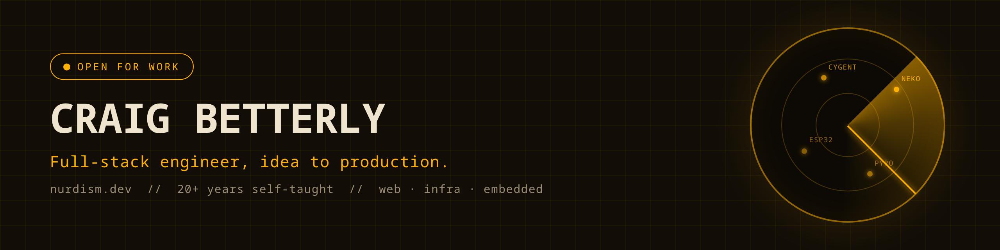
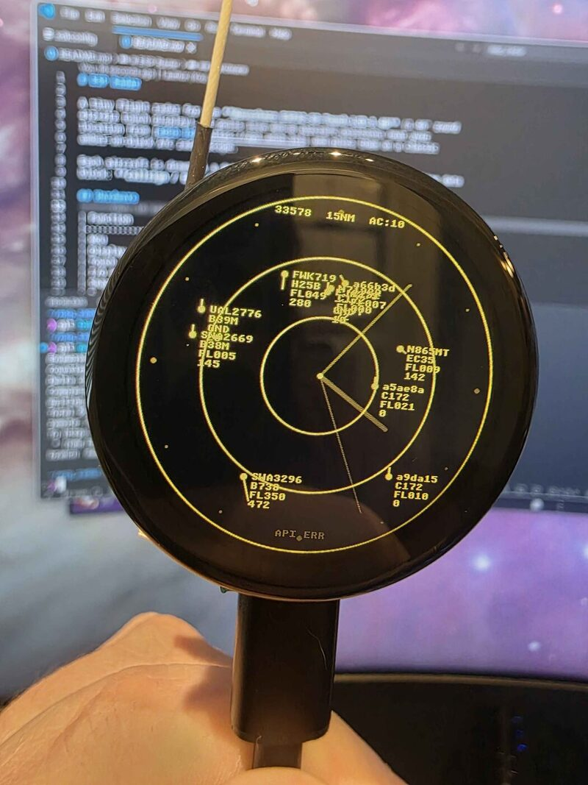
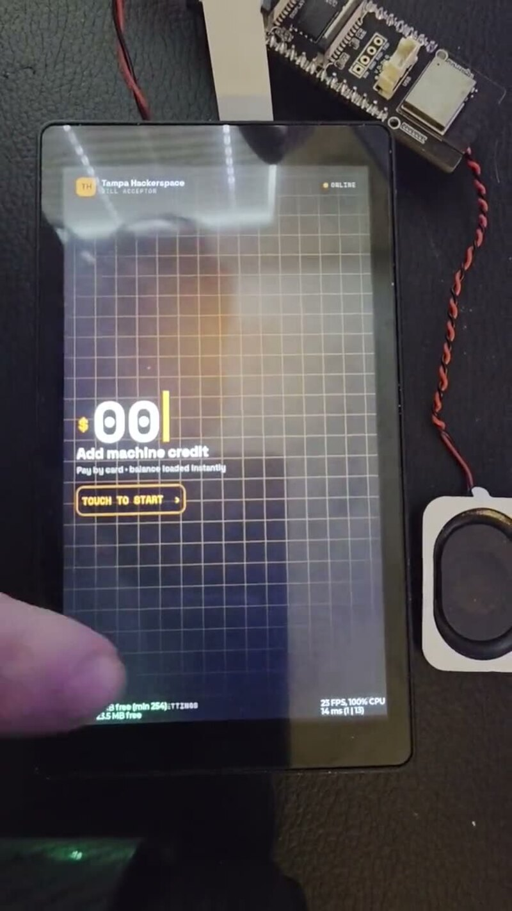
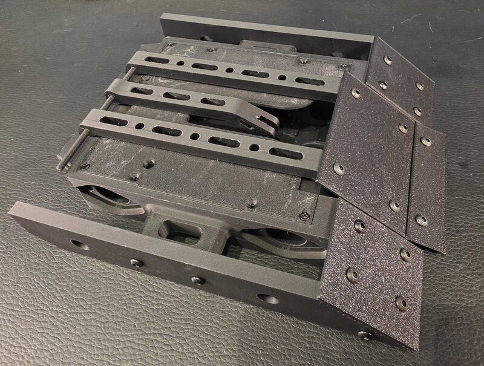
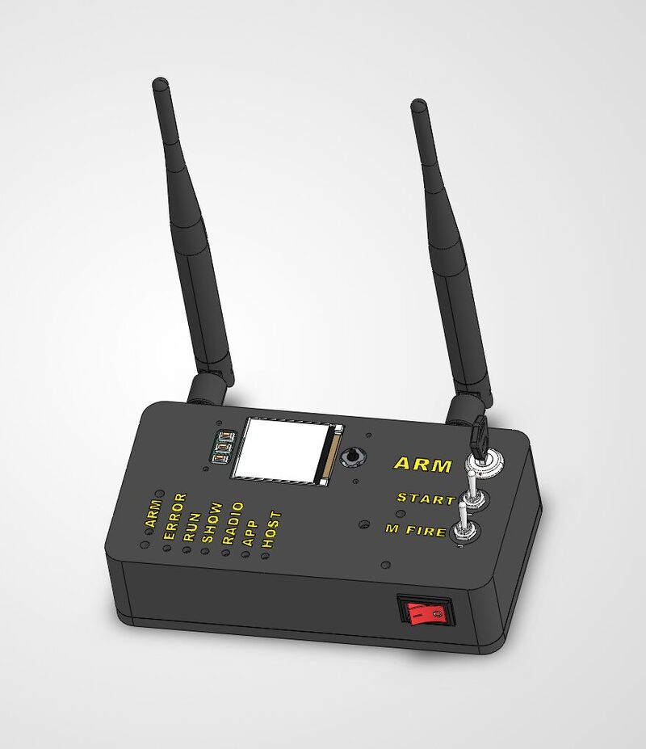

  
  
  
  
  

I'm Craig. I dropped out to learn to code, and twenty-some years later the range runs
from web apps and chain infrastructure to Docker fleets, ESP32 firmware, and 3D-printed battle bots.
Self-taught the whole way. Hard worker, fast learner: a new stack is usually a weekend.

**Currently open for work**: full-stack product, platform and infrastructure, or embedded.

### The short version

- Built **[neko](https://github.com/nurdism/neko)**, a self-hosted virtual browser (Go, pion/WebRTC, hand-rolled GStreamer cgo bindings, Vue).
  First commit to v1.0.0 in sixteen days. 2,077 stars here, 145K Docker pulls, and the community continuation
  ([m1k1o/neko](https://github.com/m1k1o/neko)) is past 21,000 stars and going strong.

  > "Neko seriously feels like magic the first time you run it."
  >  Sean DuBois, creator of Pion WebRTC, [posting it to Show HN](https://news.ycombinator.com/item?id=22079367)

- Most recently **Senior Software Developer at Cyfrin**: built and ran the platform behind
  [Cygent](https://www.cygent.dev/) (their AI security engineer), stood up the BattleChain L2
  (ZKsync OS, including a [sequencer fix merged upstream](https://github.com/matter-labs/zksync-os-server/pull/927)),
  and spent a year on [Cyfrin Updraft](https://updraft.cyfrin.io/)'s backend APIs, notification system,
  and platform infrastructure (200,000+ students).
- Founder of **[Ticketeer](https://ticketeer.bot/)**, a Discord support SaaS: 4,200+ communities, 3.4M+ users, 337K+ tickets.
- Formerly **CTO at CLOSEM**: built a full CRM (SMS/MMS, email marketing, voice, automation) and led the engineering team.
- Merged upstream over the years: discord.js, TypeORM, Vuelidate, laravel/vite-plugin, Coolify, ZKsync OS server, BackyardHero Pyro, and more. I fix the tools I use.

### On the bench

<table>
  <tr>
    <td width="50%" valign="top">
      
      <b><a href="https://github.com/nurdism/esp_radar">esp_radar</a></b> 
      A live ADS-B flight radar on a round ESP32-S3 touch display: real aircraft, amber ATC scope, doubles as a clock.
      C, ESP-IDF, LVGL, hand-rolled drivers, with related PRs sent upstream to Espressif.
    </td>
    <td width="50%" valign="top">
      
      <b><a href="https://github.com/nurdism/hackceptor">hackceptor</a></b> 
      A card-to-cash bridge for the Tampa Hackerspace vending machine: QR, Stripe, authenticated WebSocket,
      and an ESP32-P4 kiosk pulsing the "$1 accepted" line through an opto-isolator.
    </td>
  </tr>
  <tr>
    <td width="50%" valign="top">
      
      <b>Battle bots, Tampa Hackerspace</b> 
      I head the robotics team. Current antweight: designed in SolidWorks, printed and armored in-house,
      weighed in at 452.76 g with less than a gram to spare under the 1 lb limit.
    </td>
    <td width="50%" valign="top">
      
      <b><a href="https://github.com/libpyro">libpyro</a></b> 
      Open-source pyro ignition systems: my transmitter design moving from SolidWorks to the bench,
      plus two PRs merged into BackyardHero's show-control software.
    </td>
  </tr>
</table>

Also in the drawer: **grit engine**, a falling-sand game in Rust (closed source for now), and a homelab
that tests everything before it ships (Coolify, Jellyfin, Headscale, all Docker).

### Twenty-some years, very abridged

| | |
|---:|---|
| early '00s | Dad's computer repair shop. First code at 14 (PHP, VB.NET). Dropped out to do it full-time. |
| 2007 | Technical half of the family marketing firm: 50+ WordPress sites. "Craig is the geek king," their words. |
| 2017 | First merged PR into discord.js. Minecraft modpacks (17.8K downloads). |
| 2020 | neko ships. CTO at CLOSEM, building the CRM and leading the team. |
| 2021 | Ticketeer launches. neko handed to the community, where it grew 10x. |
| 2025 | Cyfrin: a year of Updraft backend and platform infrastructure. |
| 2026 | Stood up the BattleChain L2. Built and ran the Cygent platform. |
| now | Open for work. [Send a signal.](https://nurdism.dev/#contact) |

### Languages

### Frameworks, tools & infrastructure

### Hardware & fabrication

  

### Off the keyboard

Head of the robotics team (battle bots) at Tampa Hackerspace. Shop-trained on the laser cutter, lathe, and mill.
Learning pottery. Cat dad to Moe, the best bud a nerd could ask for. The neko cat-butt logo? Long story, see the repo.

### Get in touch

  
  
  
  

